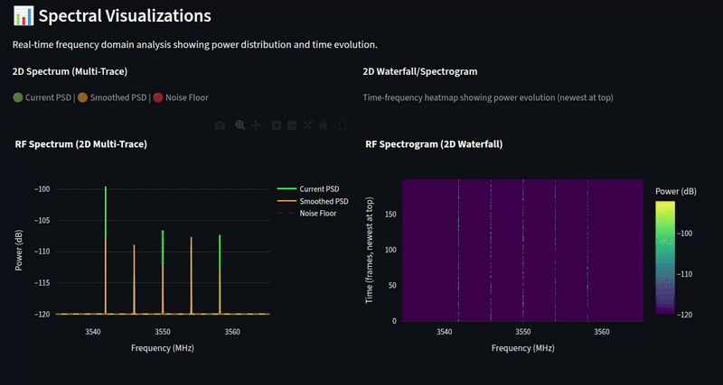
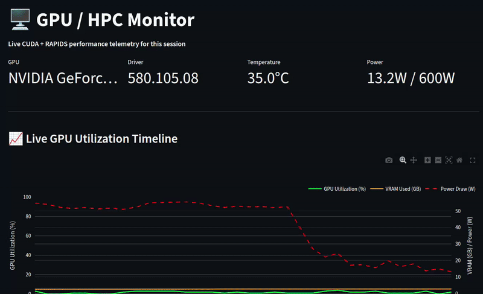

# RF-Spectrum-Observatory

[](https://github.com/Pouria-007/RF-Spectrum-Observatory)

**GPU-accelerated RF spectrum observatory with real-time DSP and geospatial visualization**

A high-performance platform for RF spectrum analysis that combines CUDA-accelerated signal processing with geospatial analytics to visualize RF signal strength across geographic tiles in real-time.

---

## 📸 **Screenshots & Demos**

### **Spectral Visualization (Real-Time FFT + Waterfall)**


*Real-time Power Spectral Density (PSD) with smoothing and noise floor estimation, plus live waterfall/spectrogram showing frequency evolution over time.*

---

### **3D Geospatial RF Heatmap with Drone Tracking**


*Interactive 3D extruded map showing RF signal strength across geographic tiles. Yellow helicopter marker tracks drone position. Column height represents signal power (dB). Click tiles for detailed metrics.*

---

### **Live Demos (Animated)**

> 🎬 **Auto-playing demos below** (click for full-quality video downloads)

#### **📡 Geospatial Live RF Map (Drone Flight Path)**

<div align="center">
  <a href="https://github.com/Pouria-007/RF-Spectrum-Observatory/raw/main/docs/images/Geospatial_Live_RF_Map_Drone_Flight_Path.webm">
    
  </a>
  <p><i>Interactive 3D map showing drone flight path with real-time RF signal measurements. Yellow helicopter marker tracks position, tiles show power levels. (Click to download full video)</i></p>
</div>

---

#### **📊 Spectral Visualization (Real-Time)**

<div align="center">
  <a href="https://github.com/Pouria-007/RF-Spectrum-Observatory/raw/main/docs/images/Spectral_Visualization.webm">
    
  </a>
  <p><i>Live spectrum analyzer and waterfall display updating in real-time with synthetic 5G-like signals. (Click to download full video)</i></p>
</div>

---

#### **🖥️ GPU HPC Monitor (Performance Telemetry)**

<div align="center">
  <a href="https://github.com/Pouria-007/RF-Spectrum-Observatory/raw/main/docs/images/GPU_HPC_Monitor.webm">
    
  </a>
  <p><i>Real-time GPU utilization, memory usage, power draw, and throughput metrics for HPC workload monitoring. (Click to download full video)</i></p>
</div>

---

#### **📊 Raw Data Stream (Low-Level Inspection)**

<div align="center">
  <a href="https://github.com/Pouria-007/RF-Spectrum-Observatory/raw/main/docs/images/Raw_Data_Monitor.webm">
    
  </a>
  <p><i>Raw IQ samples, GPS fixes, and DSP features inspection for debugging and validation. (Click to download full video)</i></p>
</div>


---

## 🎯 Overview

This platform simulates drone-based RF data collection, processing IQ samples through a GPU-accelerated DSP pipeline and visualizing signal strength on interactive 2D/3D maps. Built for spectrum observability, interference detection, and coverage analysis.

### Key Capabilities

- **Real-time GPU DSP**: FFT, PSD, and spectral feature extraction using CuPy/cuFFT/cuSignal
- **Geospatial Aggregation**: Tile-based RF metrics computed on GPU with RAPIDS cuDF
- **Live Dashboard**: Interactive Streamlit UI with spectrum plots, waterfall, and 2D/3D heatmaps
- **Hardware-Agnostic**: Synthetic data mode (no SDR required) with extensible hardware interfaces
- **Export Pipeline**: Parquet and GeoJSON outputs for offline analysis

---

## 🏗️ System Architecture

```
┌─────────────────┐
│  IQ Source      │  Synthetic IQ generator (5G-like OFDM + interference)
│  (Synthetic)    │  Hardware SDR support (RTL-SDR, USRP) via extensible interface
└────────┬────────┘
         │
         ▼
┌─────────────────┐
│  GPU DSP        │  CuPy/cuFFT: Windowing → FFT → PSD (dB)
│  Pipeline       │  cuSignal: EMA smoothing, noise floor estimation
└────────┬────────┘  Band features: bandpower, occupancy, anomaly detection
         │
         ▼
┌─────────────────┐
│  GPS Alignment  │  Synthetic GPS route (configurable speed/path)
│  & Features     │  Aligns IQ frames with GPS fixes
└────────┬────────┘
         │
         ▼
┌─────────────────┐
│  Geo            │  RAPIDS cuDF: GPU-accelerated groupby aggregation
│  Aggregation    │  Tile grid: configurable size (e.g., 20m × 20m)
└────────┬────────┘  Metrics: mean/max bandpower, occupancy per tile
         │
         ▼
┌─────────────────┐
│  Visualization  │  Streamlit: Real-time dashboard
│  & Export       │  PyDeck: 2D/3D geospatial heatmaps (Deck.gl)
└─────────────────┘  Plotly: Spectrum & waterfall plots
                     Export: Parquet (frames/tiles) + GeoJSON (tiles)
```

**Data Flow**: IQ samples → GPU DSP → Features → Tile Aggregation → Visualization

---

## 🚀 Quick Start

### Prerequisites

- **GPU**: NVIDIA GPU with CUDA Compute Capability 7.0+ (Volta, Turing, Ampere, Ada, Hopper)
- **CUDA**: 12.x or 13.x with matching driver
- **RAM**: 16 GB+ recommended
- **OS**: Linux (Ubuntu 20.04+) or Windows WSL2
- **Conda**: Miniconda or Anaconda

### Installation

1. **Clone the repository**
   ```bash
   git clone https://github.com/yourusername/RF_Intelligence.git
   cd RF_Intelligence
   ```

2. **Create conda environment**
   ```bash
   bash conda/create_env.sh
   # This creates a 'rapids' environment with CUDA 12 or 13 (auto-detected)
   ```

3. **Activate environment**
   ```bash
   conda activate rapids
   ```

4. **Verify installation**
   ```bash
   ./verify.sh
   # Runs comprehensive checks: environment, modules, synthetic data, DSP, export
   ```

### Running the Dashboard

```bash
conda activate rapids
streamlit run src/📡_RF_Observatory.py
```

**OR** (backward compatible):
```bash
streamlit run src/streamlit_app.py
```

Open your browser to **`http://localhost:8501`**

---

## 📊 Dashboard Features

The platform includes **three interactive pages**, each optimized for specific use cases:

---

### 📡 **Page 1: RF Observatory** (Main Dashboard)

The primary interface for real-time RF spectrum analysis and geospatial visualization.

#### **1. RF Spectrum (2D)**
- Real-time PSD plot with current, smoothed, and noise floor traces
- Configurable frequency bands (e.g., CBRS Band 48, 5G n77)
- Live bandpower and occupancy metrics

#### **2. Waterfall / Spectrogram (2D)**
- Time-frequency heatmap showing spectral evolution
- Configurable colormap and history depth
- Frequency axis aligned with center frequency

#### **3. Geospatial RF Map (2D/3D)**
- **2D Heatmap**: Color-coded tiles showing RF signal strength
- **3D Extruded Map**: Column height represents signal power
- **Drone Marker**: Yellow helicopter marker shows current GPS position
- **Interactive**: Click tiles for detailed metrics (lat/lon, power, frame count)

#### **4. DSP Processing Summary**
- Real-time throughput metrics (frames/sec, windows/sec, samples/sec)
- FFT parameters (size, window type, overlap)
- PSD computation pipeline breakdown
- Throughput relationships (theoretical vs. measured)

#### **5. System Status**
- GPU detection and memory usage
- RAPIDS RMM pool statistics
- Pipeline health monitor (IQ, GPS, DSP, Geo, UI)

---

### 🖥️ **Page 2: GPU / HPC Monitor** (Performance Telemetry)

**Purpose**: Real-time GPU and system performance monitoring for HPC/CUDA workloads.

**Why This Matters**: Understanding GPU utilization is critical for optimizing RF signal processing pipelines. This page provides live telemetry to help you:
- **Identify bottlenecks**: Is the GPU idle? Overloaded? Memory-bound?
- **Optimize batch sizes**: Larger batches = better GPU utilization
- **Monitor thermal/power**: Ensure sustained performance without throttling
- **Validate CUDA acceleration**: Prove that GPU processing is actually happening

#### **Key Metrics Explained** (for non-GPU experts):

**GPU Utilization (%)**
- **What it is**: Percentage of time the GPU cores are actively computing
- **Good values**: 30-80% for real-time applications
- **Low (<10%)**: GPU is idle most of the time → increase batch size or FFT size
- **High (>90%)**: GPU is saturated → may cause UI lag

**VRAM (Video RAM)**
- **What it is**: GPU memory used for storing data (IQ samples, FFT results, etc.)
- **Why it matters**: Running out of VRAM causes crashes or slowdowns
- **Pressure gauge**: Shows how close you are to the limit (green = safe, red = danger)

**Power Draw (W)**
- **What it is**: Electrical power consumed by the GPU
- **Why it matters**: Higher power = more heat → potential thermal throttling
- **Typical values**: 50-300W depending on GPU model and workload

**Frames/sec & Windows/sec**
- **Frames/sec**: How many IQ data frames are processed per second
- **Windows/sec**: How many FFT windows are computed per second
- **Why it matters**: Higher = better throughput, but must balance with UI responsiveness

**Batch Size**
- **What it is**: Number of frames processed before updating the UI
- **Trade-off**: Larger batches = better GPU utilization but slower UI updates
- **Default**: 5 frames (balanced for responsiveness)

**CPU Usage & Thread Count**
- **What it is**: Python process CPU usage and number of threads
- **Why it matters**: High CPU usage may indicate Python overhead (not GPU-bound)
- **Concurrency**: More threads = better parallelism (but diminishing returns)

#### **Features**:
- **Live GPU Utilization Timeline**: GPU%, VRAM, Power over time
- **Memory Breakdown**: Donut chart + pressure gauge
- **Throughput Gauges**: FPS, WPS, Batch size
- **Concurrency Metrics**: CPU%, thread count over time
- **Temperature Timeline**: GPU thermal monitoring

#### **Performance Control**:
- **Opt-in monitoring**: Disabled by default to minimize overhead
- **Adjustable refresh rate**: 0.5-5 Hz (default 2 Hz)
- **History length**: 30-300 seconds of telemetry data

**💡 Tip**: Enable this page only when you need to diagnose performance issues or demonstrate GPU acceleration.

---

### 📊 **Page 3: Raw Data Stream** (Low-Level Inspection)

**Purpose**: Real-time inspection of raw IQ samples, GPS fixes, and DSP features for debugging and validation.

**Why This Matters**: Sometimes you need to see the "raw" data to:
- **Debug signal issues**: Are IQ samples valid? Is GPS working?
- **Validate DSP pipeline**: Are FFT results correct? Is noise floor reasonable?
- **Understand data flow**: What does each processing stage produce?

#### **What You'll See**:

**🌊 IQ Samples (Raw RF Data)**
- **What it is**: Complex numbers (I + jQ) representing the RF signal
- **I (In-phase)**: Real component of the signal
- **Q (Quadrature)**: Imaginary component of the signal
- **Why complex?**: Captures both amplitude and phase information
- **Display**: First/last 10 samples + statistics (min, max, mean, std)

**🛰️ GPS Fix**
- **What it is**: Position data from GPS source (synthetic or real)
- **Fields**: Latitude, longitude, altitude, heading, speed
- **Why it matters**: Links RF measurements to geographic locations

**🔬 DSP Features**
- **What it is**: Processed RF metrics from the DSP pipeline
- **Frequency bins**: FFT output frequencies (Hz)
- **PSD values**: Power spectral density (dB) for each frequency
- **Noise floor**: Estimated background noise level
- **Bandpower**: Total power in specific frequency bands
- **Occupancy**: Percentage of band above noise threshold

#### **Performance Control**:
- **Opt-in streaming**: Disabled by default to minimize overhead
- **Adjustable update rate**: 1-20 Hz
- **Sample limit**: Display up to 2000 IQ samples (configurable)

**💡 Tip**: Enable this page only when you need to inspect raw data. Keeping it disabled improves main dashboard performance.

---

### 🎯 **Optimal Workflow**

**Normal Operation**:
- **RF Observatory**: Always active (main dashboard)
- **GPU HPC Monitor**: Disabled (enable when optimizing performance)
- **Raw Data Stream**: Disabled (enable when debugging)

**Performance Tuning**:
1. Enable **GPU HPC Monitor**
2. Observe GPU utilization and batch size
3. Adjust `frames_per_refresh` and `fft_size` in config
4. Disable monitor when done

**Debugging**:
1. Enable **Raw Data Stream**
2. Inspect IQ samples and DSP features
3. Verify GPS alignment
4. Disable stream when done

---

## ⚙️ Configuration

Edit `config/default.yaml` to customize:

### RF Parameters
```yaml
rf:
  center_freq_hz: 3_550_000_000  # 3.55 GHz (CBRS mid-band)
  sample_rate_sps: 30_720_000    # 30.72 MS/s (5G bandwidth)
  fft_size: 4096                 # FFT size (frequency resolution)
```

### DSP Settings
```yaml
dsp:
  window_type: "hann"            # Window function
  smoothing_factor: 0.2          # EMA alpha
  noise_floor_percentile: 10     # Noise floor estimation
  overlap_fraction: 0.0          # FFT overlap (0.0 = no overlap)
```

### Geospatial Settings
```yaml
geo:
  map_center_lat: 37.7946        # San Francisco (example)
  map_center_lon: -122.3999
  tile_size_meters: 20.0         # 20m × 20m tiles
  grid_extent_meters: 2500.0     # 2.5km × 2.5km coverage
  aggregate_window_frames: 5     # Frames per tile aggregation
```

### Performance
```yaml
performance:
  update_rate_hz: 10.0           # UI refresh rate
  max_frames_buffer: 1000        # Frame history limit
  rmm_pool_size_gb: null         # RMM pool (null = disabled)
```

---

## 🧪 Synthetic Data Mode

The platform includes a **synthetic data generator** that simulates realistic RF environments without requiring hardware:

- **IQ Signal**: 5G-like OFDM carriers + configurable interference (burst jammer, swept tone)
- **GPS Route**: Configurable speed (default 50 m/s), grid-walk pattern across city
- **Deterministic**: Reproducible results with seed control

**Use Cases**:
- Development and testing without SDR hardware
- Demonstrations and training
- Algorithm validation with known ground truth

---

## 🛠️ Technology Stack

| Component | Technology |
|-----------|-----------|
| **GPU Computing** | CuPy, cuFFT, cuSignal (RAPIDS) |
| **Data Processing** | RAPIDS cuDF (GPU DataFrames) |
| **Memory Management** | RAPIDS RMM (optional) |
| **UI Framework** | Streamlit |
| **Visualization** | PyDeck (Deck.gl), Plotly |
| **Geospatial** | Shapely, GeoJSON |
| **Configuration** | PyYAML |
| **Language** | Python 3.11 |

---

## 📁 Project Structure

```
RF_Intelligence/
├── conda/                    # Environment setup scripts
│   ├── create_env.sh         # Auto-detects CUDA version
│   ├── environment_cuda12.yml
│   └── environment_cuda13.yml
├── config/
│   └── default.yaml          # Central configuration
├── assets/                   # Auto-generated synthetic data
│   ├── maps/                 # GeoJSON base maps
│   └── routes/               # GPS routes (CSV)
├── outputs/                  # Exported data (Parquet, GeoJSON)
├── src/
│   ├── streamlit_app.py      # Main UI entry point
│   ├── common/               # Types, config, timebase, system status
│   ├── ingest/               # IQ/GPS sources (synthetic + hardware stubs)
│   ├── dsp/                  # GPU DSP pipeline (FFT, PSD, features)
│   ├── geo/                  # Tiling, aggregation, geometry, export
│   ├── ui/                   # Streamlit components (spectrum, map, controls)
│   └── perf/                 # RMM, benchmarks, profiling
├── docs/                     # Architecture and guides
│   ├── ARCHITECTURE.md
│   ├── HARDWARE_INTEGRATION.md
│   ├── INTERFACES.md
│   ├── PERFORMANCE.md
│   └── UI_GUIDE.md
├── tests/                    # Unit and integration tests
├── verify.sh                 # Comprehensive verification script
└── README.md
```

---

## 🎓 Use Cases

1. **Spectrum Observability**: Monitor RF activity patterns over time and geography
2. **Interference Detection**: Identify anomalous signals (jammers, unintended emissions)
3. **Coverage Analysis**: Map signal strength for network planning
4. **5G Research**: Study sub-6 GHz band dynamics (CBRS, n77, n78)
5. **Education**: Teach DSP, GPU computing, and geospatial analytics

---

## 🔮 Future Enhancements

- **Real-time Hardware Integration**: RTL-SDR, USRP, LimeSDR via SoapySDR/UHD
- **Background Worker**: Decouple data ingestion from UI for sustained high-rate processing
- **Advanced DSP**: Welch's method, STFT, modulation classification
- **Multi-Drone Support**: Fleet visualization with independent GPS paths
- **Cloud Deployment**: Scalable processing with GPU clusters
- **ML Integration**: Anomaly detection, signal classification

---

## 📚 Documentation

- **[ARCHITECTURE.md](docs/ARCHITECTURE.md)** - Detailed system design, data flow, and module responsibilities
- **[HARDWARE_INTEGRATION.md](docs/HARDWARE_INTEGRATION.md)** - Guide for integrating real SDR hardware
- **[INTERFACES.md](docs/INTERFACES.md)** - API contracts for IQ/GPS sources and pipeline components
- **[PERFORMANCE.md](docs/PERFORMANCE.md)** - Benchmarks, profiling, and optimization strategies
- **[UI_GUIDE.md](docs/UI_GUIDE.md)** - Dashboard usage and control explanations

---

## ⚠️ Limitations & Disclaimers

**This platform does NOT:**
- Decode user data or demodulate encrypted traffic
- Transmit RF signals (receive-only)
- Track individuals or violate privacy
- Implement SDR firmware or low-level hardware drivers

**Intended Use**: Research, education, spectrum monitoring, and network analysis in compliance with local regulations.

---

## 🤝 Contributing

Contributions are welcome! Areas of interest:
- Hardware source implementations (RTL-SDR, USRP, HackRF)
- Additional DSP algorithms (Welch, MUSIC, cyclostationary analysis)
- Performance optimizations (kernel fusion, multi-GPU)
- UI enhancements (custom colormaps, animation controls)

---

## 📄 License

MIT License - See [LICENSE](LICENSE) for details

---

## 🙏 Acknowledgments

- **RAPIDS AI**: GPU-accelerated data science ecosystem (cuDF, cuSignal, CuPy, RMM)
- **Streamlit**: Rapid web app development framework
- **Deck.gl / PyDeck**: High-performance geospatial visualization
- **Plotly**: Interactive plotting library
- **NVIDIA**: CUDA toolkit and GPU computing platform

---

## 📧 Contact

For questions, issues, or collaboration opportunities, please open an issue on GitHub.

---

**Built with ❤️ for the RF and GPU computing communities**
